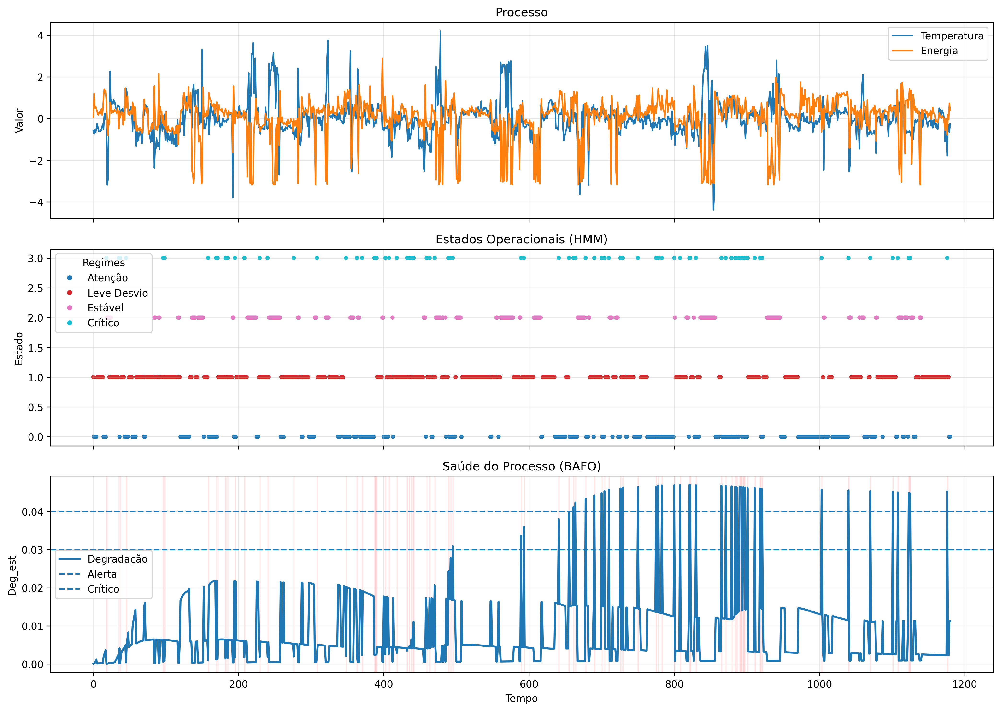
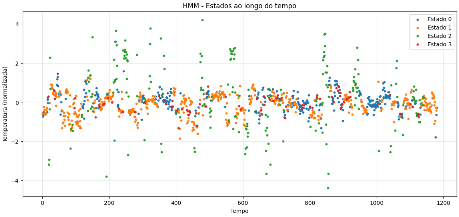
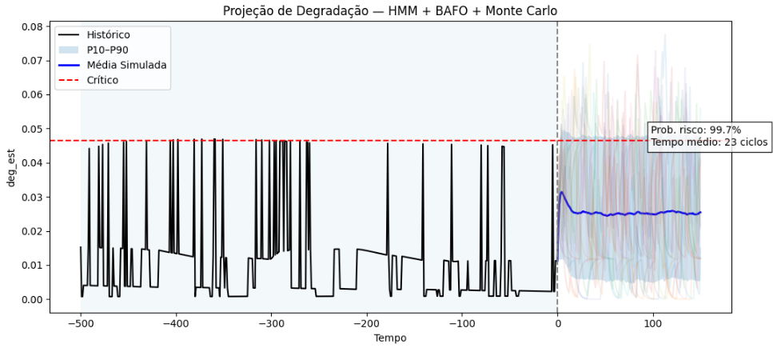

# BAFO Framework — Dynamic System Monitoring with Regime Detection and Risk Projection

## ⚡ TL;DR
A framework to model real-world dynamic systems under regime changes and quantify future operational risk using probabilistic simulation.

## 🔍 Integrated View — Signal, Regimes and Degradation

<p align="center">
  
  <br>
  <em>Integrated view of signal, regimes and degradation</em>
</p>

This visualization summarizes the core idea of the framework:

- Raw process signals (temperature and energy)  
- Operational regimes identified by HMM  
- Degradation evolution estimated by BAFO  

It highlights how:

- regime changes impact degradation  
- short critical periods lead to accumulation  
- system health is not fully recovered after deviations
  
---

## 📊 Key Results

- Critical state occurrence: ~7% of total time  
- Disproportionate degradation impact during short events  
- Estimated time to risk: ~24 cycles  

---

## 🧠 Motivation

Most models fail in real-world systems because they assume the system behaves consistently over time.

In practice, this is not true.

Operational regimes change, behavior shifts, and uncertainty is inherent.

Instead of trying to build a single global model, this framework focuses on:

> Detecting regime changes and evaluating system health within each regime.

---

## ⚙️ Framework Overview

The pipeline follows:

```
data → features → regimes (HMM) → degradation (BAFO) → risk projection (Monte Carlo)
```

- **HMM** identifies hidden operational regimes  
- **BAFO** estimates degradation dynamically  
- **Monte Carlo** simulates future trajectories and risk exposure 

---

 ## 🏭 Applications

This framework is designed for real-world industrial systems, including:

- Manufacturing processes (thermal, chemical, mechanical)
- Energy systems and utilities
- Continuous production lines
- Equipment health monitoring

It is especially useful in systems where:

- behavior is non-stationary  
- regimes shift over time  
- degradation is cumulative and not immediately visible  

---

## ⚡ What makes this different

Unlike traditional approaches, this framework:

- does not assume stationarity  
- does not rely on fixed thresholds  
- explicitly models regime-dependent behavior  
- combines **state detection + degradation + future risk**

This transforms monitoring from:

> anomaly detection → dynamic system understanding

---

## 🧠 BAFO — Bayesian Adaptive Fault Observer

The BAFO (Bayesian Adaptive Fault Observer) is the core component responsible for estimating the **dynamic degradation of the system over time**.

Unlike static anomaly detection methods, BAFO:

- adapts its baseline online  
- incorporates system dynamics (signal + slope)  
- models uncertainty through Bayesian inference  
- accumulates degradation with memory  

---

### ⚙️ How it works

At each time step:

1. The signal is smoothed and normalized relative to a dynamic baseline  
2. A slope term is incorporated to capture transient behavior  
3. A latent variable combines level and dynamics  
4. A Bayesian update estimates fault probability (`posterior`)  
5. A degradation state (`deg_est`) is updated with memory  

---

### 🔁 Key mechanisms

- **Adaptive baseline** → updated only in healthy conditions  
- **Bayesian inference** → balances normal vs fault likelihood  
- **Forgetting factor** → adapts to slow system drift  
- **Degradation memory** → accumulates past deviations  

---

### 📈 Output

- `posterior` → probability of fault  
- `deg_est` → accumulated degradation  
- `detected_index` → first critical detection  

---

## 🔎 Regime Detection (HMM)

The HMM segments the process into distinct operational states, each with different statistical behavior.



---

## 🚨 Risk Projection (Monte Carlo)



Future degradation is simulated under uncertainty, allowing estimation of:

- probability of reaching critical states  
- expected time to risk  
- cumulative exposure  

---

## 📈 Key Insights

- The system operates mostly in stable conditions  
- Short critical periods drive disproportionate degradation  
- The process exhibits **degradation memory**  

---

## 🚀 Outcome

This approach enables, in practical terms:

- Early detection of operational risk  
- Transition from reactive to predictive monitoring  
- Decision-making based on probabilistic future scenarios  
- Reduction of unplanned downtime  
- Early identification of hidden degradation  
- Risk-aware operational decisions  

---

## 💡 Takeaway

> It is not about predicting the system.  
> It is about tracking its dynamics and managing risk over time.

---
## ▶️ How to Run

### 1. Clone the repository

```bash
git clone https://github.com/VictorAMachado/bafo-framework.git
cd bafo-framework
```
### 2. Create environment

```bash
python -m venv venv
source venv/bin/activate  # Linux / Mac

# or

venv\Scripts\activate     # Windows
```

### 3. Install dependencies

```bash
pip install -r requirements.txt
```
### 4. Run the notebook

```bash
jupyter notebook
```
#### Open

```bash
notebooks/bafo_framework_analysis.ipynb
```
### 5. Execute

Run all cells to reproduce:

- Data ingestion and preprocessing
- Feature engineering
- HMM regime detection
- BAFO degradation estimation
- Monte Carlo risk simulation

### 📌 Notes

- The dataset is already anonymized (`data/data_anon.csv`)  
- No external data is required  
- All results and figures can be reproduced directly from the notebook  

---

## 📁 Repository Structure

```
bafo-framework/
│
├── README.md
├── requirements.txt
├── LICENSE
│
├── data/
│   └── data_anon.csv
│
├── notebooks/
│   └── bafo_framework_analysis.ipynb
│
├── outputs/
│   ├── hmm_states.png
│   ├── integrated_process.png
│   └── monte_carlo.png
│
└── src/
    ├── bafo.py
    ├── simulation.py
    └── metrics.py
```

---

## ⚠️ Data Note

All data has been anonymized and transformed to preserve structural behavior while removing any sensitive or proprietary information.

---

## ⚠️ Operational Context

The estimated time to risk (~24 cycles) should be interpreted within the context of the process.

Considering that each cycle lasts approximately 300 seconds, this corresponds to a relatively short time window for the system to reach critical degradation levels.

This indicates that:

- risk escalation can occur rapidly  
- short sequences of non-ideal operation may have significant impact  
- early detection is essential for maintaining process stability  

It is important to note that this estimation is based solely on operational data.

Further refinement of the model can be achieved by incorporating:

- historical failure events  
- maintenance records  
- real downtime occurrences  

This would allow calibration of degradation thresholds and improve alignment between modeled risk and actual system failures.

---

## 👤 Author

Victor Augusto Machado Dutra  
Engineer — Control Systems, Industrial Data & Decision Intelligence
